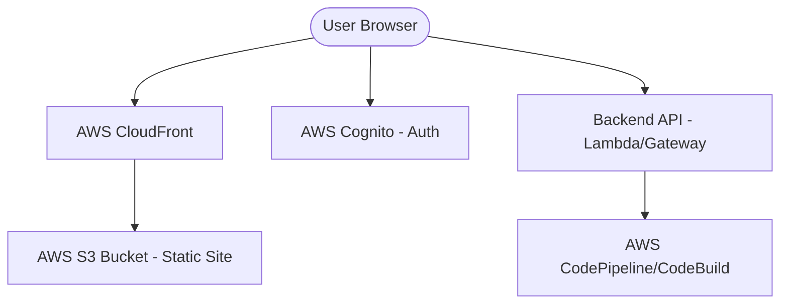

# Architecture Design Document (ADD)

## 1. System Overview
The Blueprint Deploy application is a decoupled frontend-backend system. This repository contains the React frontend, which communicates with a serverless backend on AWS.

## 2. Technology Stack

### 2.1 Frontend
- **Framework**: React 19
- **Build Tool**: Vite
- **Language**: TypeScript
- **Styling**: Tailwind CSS
- **Components**: Radix UI (Headless) + custom styled wrappers (shadcn/ui style).
- **Icons**: Lucide React
- **HTTP Client**: Axios

### 2.2 Infrastructure & DevOps
- **Hosting**: AWS S3 (Static Website Hosting)
- **CDN**: AWS CloudFront
- **Auth**: AWS Amplify / Cognito (OIDC)
- **CI/CD**: GitHub Actions
- **Infrastructure as Code**: Not in this repo (external backend likely uses CDK or Terraform).

## 3. High-Level Architecture Diagram (Mental Model)

## 4. Key Components

### 4.1 Authentication Service (`AuthContext.tsx`)
Wraps the application with AWS Amplify. Manages sign-in/sign-out state and provides the user object to the rest of the app.

### 4.2 API Layer (`src/lib/api.ts`)
Centralized Axios instance. Defines types for all requests and responses, ensuring type safety across the application.

### 4.3 Deployment Engine (`Home.tsx`)
Coordinates the main dashboard state. Handles switching between the deployment list and the status monitoring view based on URL parameters (`pipelineExecutionId`).

## 5. Security Architecture
- **JWT Tokens**: Authentication tokens from Cognito are handled by AWS Amplify and sent via the API client.
- **Environment Variables**: `VITE_` prefixed variables are used to inject API endpoints and region information at build time.
- **OIDC**: Deployment to AWS uses OpenID Connect to avoid long-lived credentials in GitHub Secrets.
